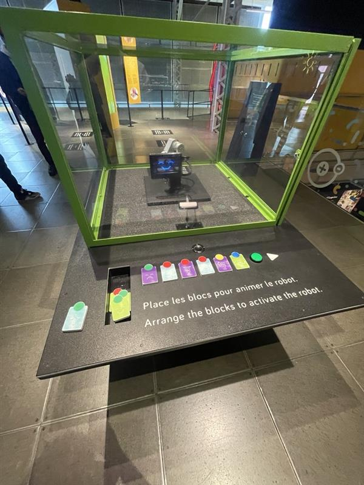

# Présentation exposition Centre des sciences #
 
 <h3>Le Meca500</h3>

<h3>En quoi consiste le Meca500</h3>
Conçu, fabriqué et assemblé à Montréal, le robot vedette de Mecademic, nommé Meca500, a la même fonction que les autres bras robots à six axes (six articulations motorisées), soit de déplacer des objets dans l’espace.

