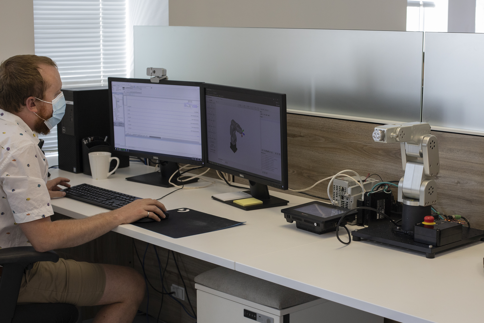
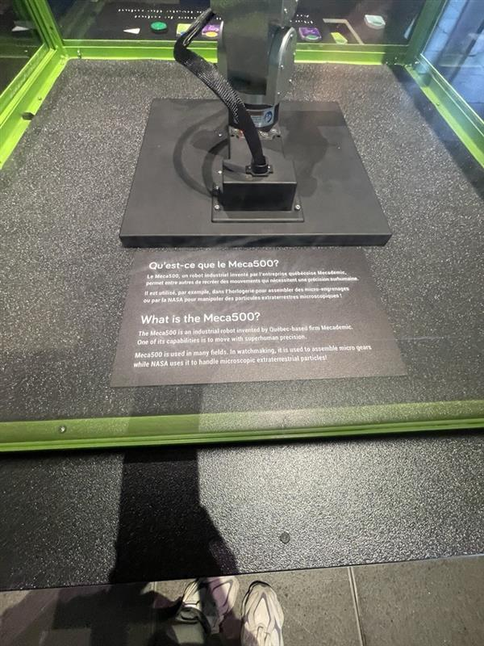

# Présentation exposition Centre des sciences #
 
 <h3>Le Meca500</h3>

<h3>En quoi consiste le Meca500</h3>
Conçu, fabriqué et assemblé à Montréal, le robot vedette de Mecademic, nommé Meca500, a la même fonction que les autres bras robots à six axes (six articulations motorisées), soit de déplacer des objets dans l’espace.

<h3>Description du dispositif</h3>
Le Meca500 est un robot dont seuls les mouvements de base sont programmés. Pour qu’il réalise des tâches comme danser, il faut que l’ordre vienne de l’extérieur, généralement d’un type particulier d’ordinateur, appelé automate programmable. En gros, Mecademic fournit le robot, puis le client s’occupe de son intégration.

<h3>Matériel du dispositif</h3>
Conçu, fabriqué et assemblé à Montréal, le robot vedette de Mecademic, nommé Meca500, a la même fonction que les autres bras robots à six axes (six articulations motorisées), soit de déplacer des objets dans l’espace. En fonction de l’outil installé au bout de son bras, celui-ci peut insérer des pièces, faire de l’assemblage, souder, etc.

Mais contrairement aux autres robots, le Meca500 est léger (4,5 kg), compact (on peut ranger le système au complet dans une mallette) et précis (plus ou moins 5 micromètres, soit une erreur de mesure 10 fois plus petite que l’épaisseur d’un cheveu). En plus, il est abordable et simple à utiliser, affirme le professeur.

Installés à chaque articulation du robot, des réducteurs de vitesse ultra petits permettent de faire pivoter ses articulations 100 fois moins vite que la rotation de ses moteurs. « Il y a 15 ans ça n’existait pas des réducteurs de vitesse si petits et si précis. C’est grâce entre autres à ces réducteurs qu’on a pu créer quelque chose de très compact et très précis », affirme Ilian Bonev. Alors que les autres robots industriels utilisent un gros contrôleur comme un ordinateur pour faire les calculs, le Meca500 utilise un tout petit contrôleur installé dans sa base. « Non seulement le robot est petit, mais tout le système est très compact », continue celui-ci.

<h2>Appréciation du dispositif</h2>
Malgré avoir prit du temps à comprendre son fonctionnement, j'ai beaucoup apprécier cette oeuvre. Au début je ne comprenais pas l'utilité du dispositif mais après un peu de recherche j'ai compris comment intéragir avec le dispositif.

Ce que j'ai beaucoup apprécier c'est la réactivité du dispositif et les différents mouvements et actions qu'il pouvait faire.

par contre je crois que les fabriquants auraient pus lui créer une sorte de body pour couvrir le mécanisme et le rendre plus conviviale.
